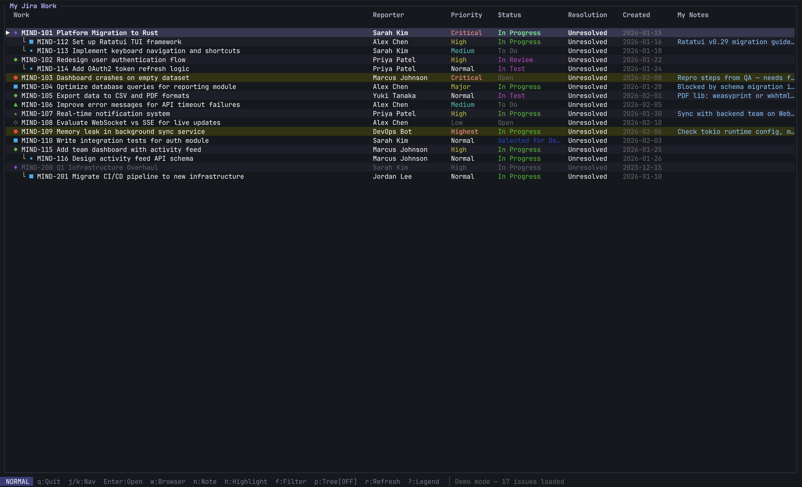
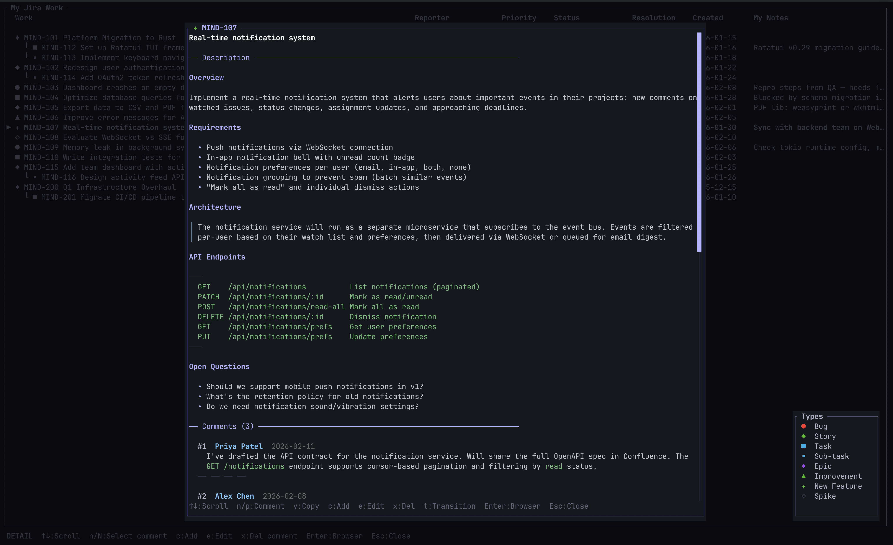
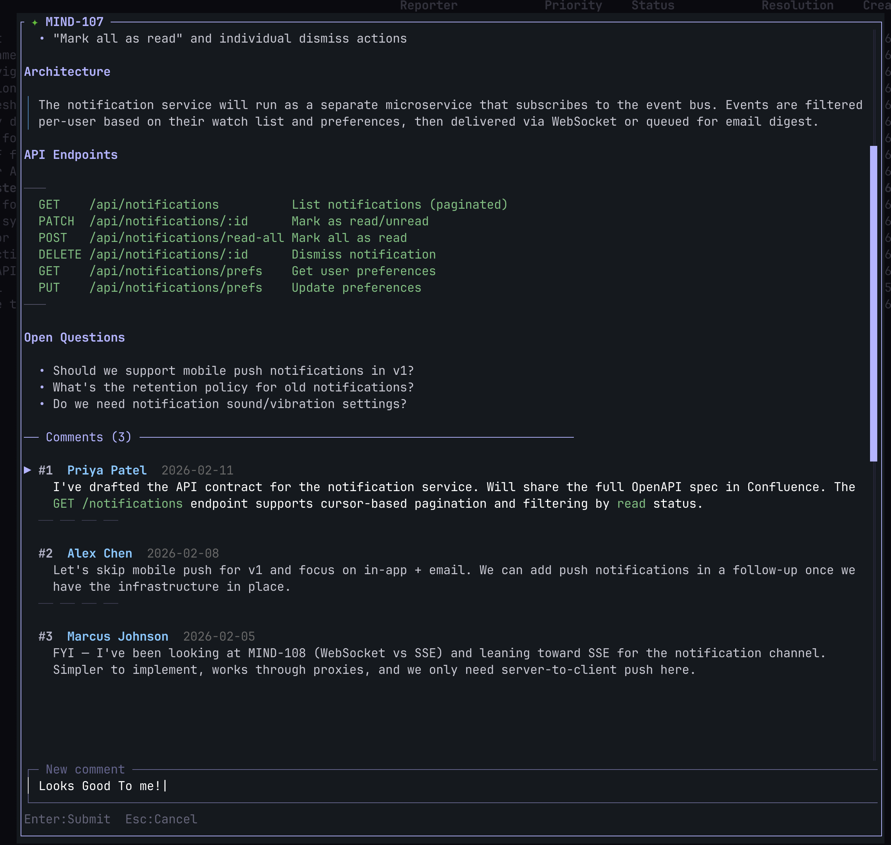

# Mindful Jira

A terminal UI for viewing and managing your Jira issues, built with Rust and [ratatui](https://github.com/ratatui/ratatui).





## Install

```bash
curl -fsSL https://git.bechsor.no/jens/mindful-jira/raw/branch/main/install | bash
```

Binaries available for macOS (ARM64/x86_64), Linux (x86_64/ARM64), and Windows (x86_64).

## Setup

```bash
mindful-jira setup   # configure Jira URL, email, and API token
mindful-jira         # launch
```

## Features

- Browse and navigate assigned issues with parent/child grouping
- Fuzzy search (`/`) to filter issues in real-time with match highlighting
- Ticket detail view with rendered markdown, code blocks, and blockquotes
- Add, edit, and delete comments directly from the terminal
- Local notes and highlights per issue
- Status filters and transition picker
- Copy ticket content to clipboard
- Open issues in browser

## Keybindings

**Issue list:** `j/k` navigate, `Enter` open detail, `w` browser, `n` note, `h` highlight, `f` filters, `/` search, `p` parents, `r` refresh, `?` legend, `q` quit

**Search:** type to filter, `Enter` keep filter, `Esc` clear

**Ticket detail:** `j/k` scroll, `n/p` next/prev comment, `c` add, `e` edit, `x` delete comment, `y` copy, `t` transition, `Enter` browser, `Esc` close

## Development

```bash
cargo build    # debug build
just build     # release build
just lint      # format + clippy
```
